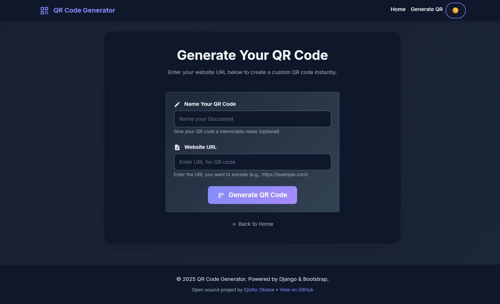

# QR Code Generator


## Demo


### DARK MODE




A modern, user-friendly web application for generating QR codes from website URLs. Built with Django and styled with Bootstrap 5.

## Features

- Generate QR codes for website URLs
- Instant QR code generation
- Fully responsive, mobile-friendly design
- Download QR codes as PNG images
- Modern UI with Bootstrap 5
- Fast and lightweight

## Prerequisites

- Python 3.8+
- Django 4.2+
- pip (Python package manager)

## Installation

1. **Clone the repository**
   ```bash
   git clone https://github.com/ken-obieze/qr.git
   cd qr
   ```

2. **Create a virtual environment** (recommended)
   ```bash
   python -m venv venv
   source venv/bin/activate  # On Windows use `venv\Scripts\activate`
   ```

3. **Install dependencies**
   ```bash
   pip install -r requirements.txt
   ```

## Running the Application

1. **Start the development server**
   ```bash
   python manage.py runserver
   ```

2. **Open your browser and navigate to**
   ```
   http://127.0.0.1:8000/
   ```

## Usage

1. **Generate a QR Code**
   - Navigate to the home page
   - Click on "Generate QR Code"
   - Enter a name for your QR code
   - Enter the URL you want to encode
   - Click "Generate QR Code"

2. **Download the QR Code**
   - After generation, click "Download QR Code" to save the image
   - The QR code will be saved as a PNG file

3. **Create Another QR Code**
   - Click "Create Another QR Code" to generate a new one

## Project Structure

```
qr/
├── django_qr/               # Main Django project directory
│   ├── forms.py            # QR code form
│   ├── views.py            # Application views
│   ├── urls.py             # URL configuration
│   └── settings.py         # Django settings
├── media/                  # Generated QR codes (gitignored)
├── templates/              # HTML templates
│   ├── base.html           # Base template
│   ├── home.html           # Home page
│   ├── generate_qr.html    # QR code generation form
│   └── view_qr.html        # QR code display page
├── venv/                   # Virtual environment (gitignored)
├── manage.py               # Django management script
├── requirements.txt        # Python dependencies
└── README.md               # This file
```

## Configuration

You can customize the following settings in `django_qr/settings.py`:

- `DEBUG`: Set to `False` in production
- `ALLOWED_HOSTS`: Add your domain in production
- `MEDIA_ROOT` and `MEDIA_URL`: Configure for media file handling
- `STATIC_URL` and `STATICFILES_DIRS`: For static files configuration

## Deployment

For production deployment, consider:

1. Using a production-ready web server like Gunicorn or uWSGI
2. Setting up a proper database (PostgreSQL recommended)
3. Configuring proper static and media file handling
4. Setting up environment variables for sensitive information
5. Using HTTPS with a valid SSL certificate

## Contributing

Contributions are welcome! Please feel free to submit a Pull Request.

1. Fork the repository
2. Create your feature branch (`git checkout -b feature/AmazingFeature`)
3. Commit your changes (`git commit -m 'Add some AmazingFeature'`)
4. Push to the branch (`git push origin feature/AmazingFeature`)
5. Open a Pull Request

## License

This project is open source and available for personal and educational use.

## Acknowledgments

- Built with [Django](https://www.djangoproject.com/)
- Styled with [Bootstrap 5](https://getbootstrap.com/)
- Icons from [Material Icons](https://fonts.google.com/icons)

---

Created by [Ejiofor Obieze](https://github.com/ken-obieze)
